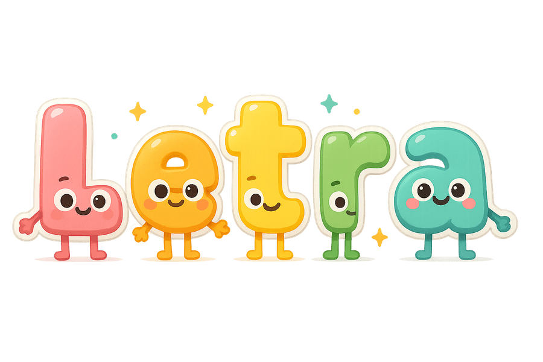

# Letra

**A 3D letter-learning adventure for pre-K kids.**

> **Powered by [Zed](https://zed.dev) + [ElevenLabs](https://elevenlabs.io).**
> Built for the [ElevenLabs × Zed Hack #6](https://hackathons.elevenlabs.io)
> hackathon — Zed's agentic editor wrote most of the code, and ElevenLabs
> voices every line the kid hears.

Letra drops a 3-to-6-year-old into a happy low-poly world full of cute, walking
letter characters with googly eyes, little arms, and big smiles. They learn the
alphabet by walking up to letters, hearing the name and the sound, and earning
trophies for every letter they master.

ElevenLabs powers every voice line in the game — a single warm, friendly voice
across the welcome, the prompts, the celebrations, and every A-Z phonetic sound.

<p align="center">
  
</p>

---

## What's in the box

Three game modes, all hands-off-able by a parent and totally driven by voice
cues so a kid who can't read yet can still navigate:

- **🐱 Spell the Word** — *"Oh no! A cat went missing! Find the letters
  C, A, T to find the cat!"* The letters scatter around the world; walk over
  them in order. Random word every time (cat / dog / sun / bus / pig).
- **🔤 Find the Alphabet** — All 26 letters laid out in a golden spiral.
  Walk to A, then B, then C… Each pickup says the letter and its sound.
- **👂 Match the Sound** — Voice plays a phonetic sound; walk to the letter
  that makes it. Endless mode: cycles through a shuffled alphabet so every
  letter shows up once before any repeats, then reshuffles. Choice count
  scales 3 → 5 as the kid plays. Wrong choice = gentle hint and a replay.

Plus:

- **🏆 Trophies** — a shelf of unlockable rewards. Stack-up trophies for
  finishing the alphabet in each case (UPPERCASE / lowercase / Mixed),
  every fifth time the kid spells a particular word, and every tenth
  successful sound-match. Plus a one-shot **Word Wizard** milestone for
  spelling 25 words altogether.
- **🔁 Replay button** — every prompt is one tap away of being repeated.
- **Hint timer** — if a kid wanders without making progress, the voice
  gently re-orients them (10 s in Sound Match, 35 s in Spell-the-Word).
- **🎵 Music** — original background tracks on a toy-instrument palette
  (toy piano, marimba, ukulele, steel drum). A dedicated menu theme plus
  a randomised pool that rolls a fresh track each time the kid enters a
  game, and a 120 BPM party track the end-of-alphabet dance is
  choreographed against.

### Personalisation

Picked from the menu before each game:

- **Avatar** — drive a chubby orange **kid**, a low-poly **car**, a
  hovering **rocket**, or a googly-eyed **tugboat**. Same omnidirectional
  movement model on all four.
- **Biome** — play in the sunny **Park** (trees, mushrooms, lily-pad pond,
  butterflies), on the **Moon** (low-grav bounding, planted flag, no
  flora), across the floating **Sky** islands, or out on the **Ocean**
  (live swell the boat really rides, jumping fish, and a volcano island
  with a sea cave — sail in and it erupts, launching you to a splashdown
  somewhere across the water). New biomes drop in by adding one file in
  `src/engine/biomes/`.
- **Letter case** — UPPERCASE, lowercase, or Mixed for Spell-the-Word and
  Find-the-Alphabet. Mixed rolls per-letter in Find-the-Alphabet and
  per-word in Spell-the-Word.

---

## Controls

The game accepts every input a small kid is likely to have within reach:

| Device | Move | Action |
|---|---|---|
| Computer keyboard | WASD or arrow keys | Space / Enter |
| Bluetooth controller (Xbox / PlayStation / generic) | Left stick or D-pad | A / X button |
| Touchscreen (phone, tablet, Chromebook) | On-screen joystick (bottom-left) | (action not needed) |

Inputs combine — plug a controller in mid-game and it just starts working.

---

## Audio

By default Letra ships with **Web Speech** as the voice engine — anyone can
download the repo and play immediately. For the hackathon-quality experience,
generate the static **ElevenLabs** audio bundle once and the game will use it
automatically.

### Run with browser speech (zero setup)

```bash
npm install
npm run dev
```

Open the URL Vite prints. Done. The browser's built-in `SpeechSynthesis` voice
narrates everything.

### Upgrade to ElevenLabs (recommended)

```bash
cp .env.example .env
# add ELEVENLABS_API_KEY=<your key> to .env
npm run audio:generate
npm run dev
```

This generates ~78 short MP3s into `public/audio/` (one for each letter name,
each phonetic sound, each game prompt, each celebration line, plus menu UI).
You only pay for it once — every kid who plays after that gets the cached audio
with zero token spend.

`npm run audio:generate` is incremental (skips clips that already exist).
`npm run audio:generate -- --force` regenerates everything.
`npm run audio:list` shows what would be generated without making any API
calls.

> **Adding clips to a voice you've already generated** (e.g. new Spell-the-Word
> words)? Use **`npm run audio:generate-all`**, not `audio:generate`. The
> `-all` variant walks every voice in the registry (`public/audio/voices.json`)
> and skips clips that already exist, so you only pay for the new ones.
>
> The plain `npm run audio:generate` picks its output folder from
> `ELEVENLABS_VOICE_NAME` (via a slug). **If that var is unset it slugs to
> `default` and writes a brand-new `public/audio/default/` folder, regenerating
> all ~160 clips from scratch** — burning credits on audio you already have, in
> a folder your registered voice isn't using. So to extend an existing voice,
> either set `ELEVENLABS_VOICE_NAME` to that voice's name first, or just use
> `audio:generate-all`.
>
> `npm run audio:list` always prints the *full* manifest (every clip that
> could exist), not just the missing ones — so don't read its count as "what
> will be generated."

The voice defaults to *Rachel* (a warm, friendly American voice). Override
with `ELEVENLABS_VOICE_ID` in `.env`.

### Music and sound effects

Two more one-shot generators, both incremental and both committed to the
repo once generated, so a fresh clone never has to run them:

```bash
npm run music:generate   # background tracks  -> public/audio/music/
npm run sfx:generate     # one-shot SFX       -> public/audio/sfx/
```

Both take `--force` to regenerate and `--list` to preview. The key needs
the **`sound_generation`** permission for `sfx:generate` — a key scoped to
text-to-speech only will 401 on every clip.

Every recorded SFX has a procedural WebAudio fallback in `src/audio/sfx.ts`,
so the game is never silent if a clip is missing or still decoding. Note
that a few specs in `scripts/generate-sfx.ts` are historical and no longer
match what the runtime loads — see the header comment there before
committing whatever it writes.

### How the runtime decides

On boot the audio player tries to fetch `public/audio/manifest.json` AND
verifies one MP3 actually exists. If both check out: ElevenLabs mode. Otherwise:
Web Speech. The chosen mode is shown in the bottom-right corner of the menu.

---

## Building & deploying

```bash
npm run build       # tsc + vite production build → dist/
npm run preview     # serve the production build locally
npm run lint        # type-check the whole project
```

The output is plain static files. Drop `dist/` on any static host (Netlify,
Cloudflare Pages, GitHub Pages, S3, the static folder of a Railway service —
no server needed).

---

## How it's built

React + Vite + TypeScript shell, plain **three.js** for the world (an
`Engine` class owns the renderer, scene, camera, and per-frame loop —
React just mounts the canvas). **Zustand** for state, **nipplejs** for
the touch joystick, **ElevenLabs** for voices.

Audio is **pre-baked** to static MP3s — credits are precious, and a
3-year-old has zero patience for "loading…".

### Designed for tiny motor skills

- Big buttons everywhere (≥240×280 in the menu, ≥84px corner buttons in the
  HUD).
- Universal icons (◀ Home, 🔁 Replay, 🏆 Trophies) so a kid who can't read
  still gets the affordance.
- Voice on hover/touch — the menu speaks the option name as you point at it.
- Generous proximity collection (1.6 m radius) so you don't have to land
  exactly on a letter.
- Hint timer that nudges instead of bossing — *"Look all around the world,
  the letter is hiding!"* — fires after long pauses.
- Joystick is sized 140 px and parked 90 px from the corner so a thumb has
  somewhere comfy to live.
- High-contrast colour cues on the HUD: green = found, pink-pulse = next.

---

## Known limitations / future work

- **Microphone pronunciation feedback** (a stretch goal) is not implemented.
  The Web Speech API's `SpeechRecognition` is good enough to get a letter back,
  but reliably grading a 3-year-old's *"buh"* is genuinely hard — it would
  need a small phoneme classifier rather than the standard word recogniser.
- The Helvetiker glyph is a stylised geometric font. A future iteration could
  swap in a curvy schoolbook font (e.g. Andika or Sassoon) to better match the
  letter shapes most pre-K classrooms use.
- Four biomes ship today (Park, Moon, Sky, Ocean), with a Jungle built but
  unlisted while its look gets more love. The biome registry makes adding
  more a one-file affair — underwater and a snowfield are obvious next
  picks.
- Audio is American English only. ElevenLabs supports many languages — adding
  Spanish or Mandarin would mostly mean a re-run of the generation script
  with translated prompts.

---

## License

Letra is licensed under the [PolyForm Noncommercial License 1.0.0](LICENSE).
You're welcome to fork it, modify it, run it for your own kids, your
classroom, your daycare, your library — basically anywhere it's not being
sold or used to make money. See `LICENSE` for the full terms.

Built by [@billums123](https://github.com/billums123).
